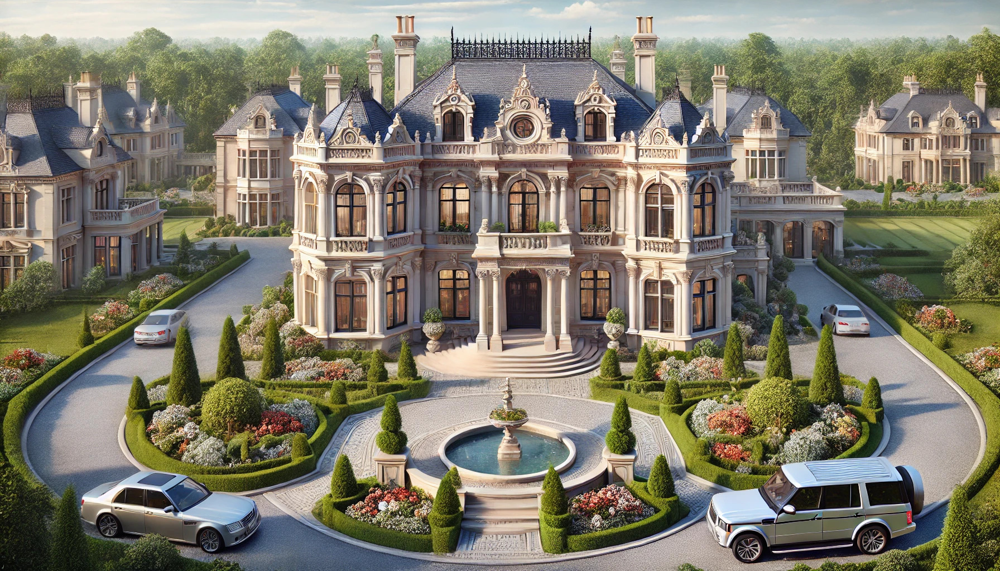
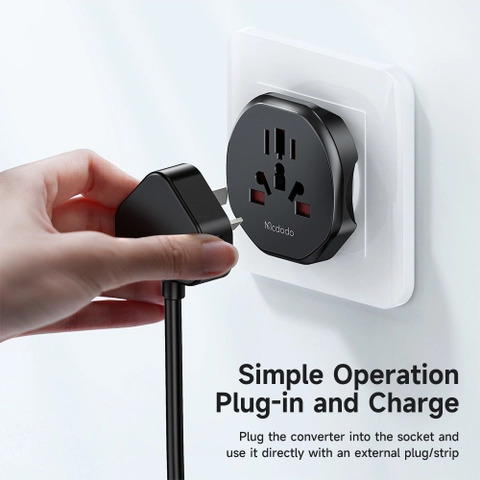
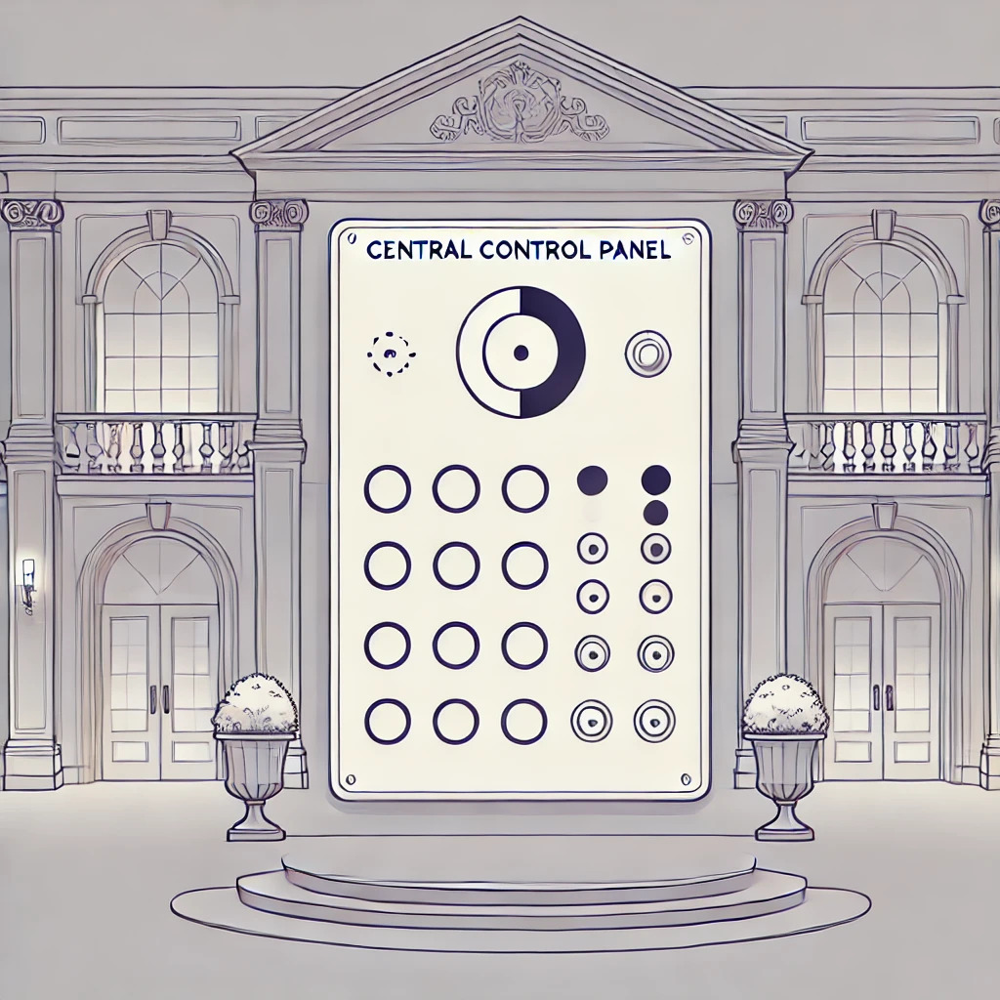
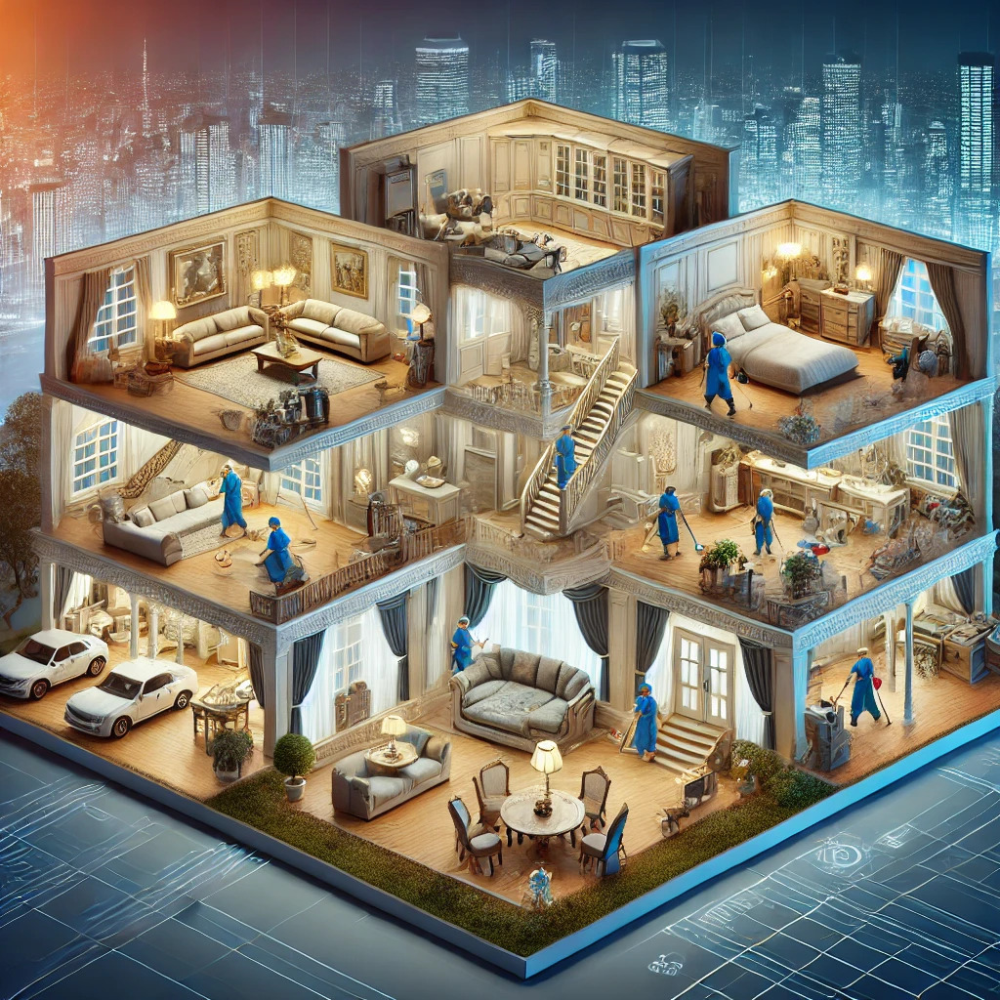
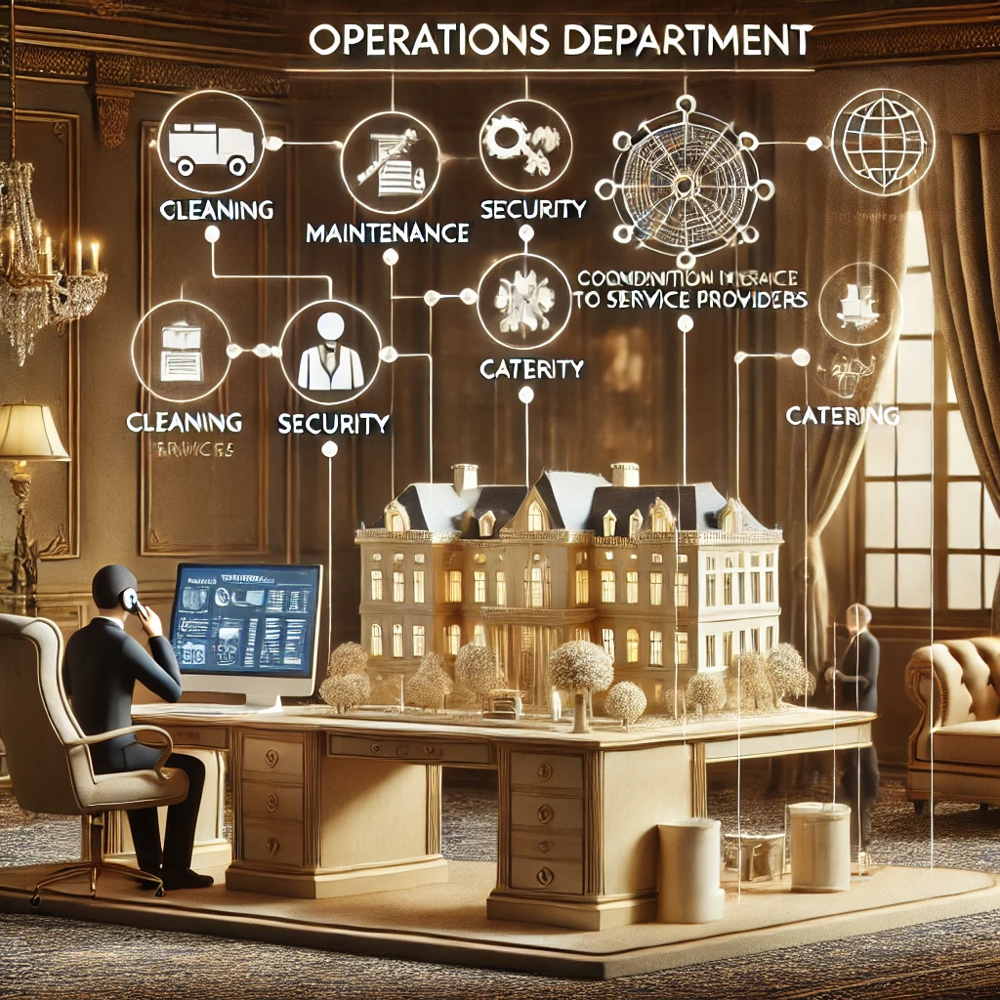

# Structural Design Patterns

## Overview
Structural design patterns explain how to assemble objects and classes into larger structures, while keeping these structures flexible and efficient.

## Summary

### 1. Adapter Pattern
**Purpose:** Allows objects with incompatible interfaces to work together.

**Implementation:** Wraps an object to provide a new interface, making it compatible with the client's expected interface.

**Pros:** Supports the Single Responsibility and Open/Closed principles, allowing for flexible and extendable code.

**Cons:** Can increase code complexity by introducing additional layers of abstraction.

**Mansion context:** You have a sophisticated intercom system that communicates in Morse code, but your new security system uses a different signaling protocol. You hire a translator who converts Morse code to the new protocol so both systems can communicate seamlessly.

### 2. Bridge Pattern
**Purpose:** Separates an abstraction from its implementation, allowing them to vary independently.

**Implementation:** Defines abstraction and implementation hierarchies that can evolve separately.

**Pros:** Enables platform-independent code, supports the Open/Closed and Single Responsibility principles.

**Cons:** Can complicate the code if applied to highly cohesive classes.

**Mansion context:** Your mansion has multiple lighting systems, each from different manufacturers. Instead of managing each system separately, you install a central control panel (the Bridge) that standardizes the interface for all lighting systems.

### 3. Composite Pattern
**Purpose:** Composes objects into tree structures to represent part-whole hierarchies, allowing clients to treat individual objects and compositions uniformly.

**Implementation:** Defines a component interface, with leaf and composite classes implementing it.

**Pros:** Simplifies client code by handling individual objects and compositions the same way, supports the Open/Closed principle.

**Cons:** Can lead to overgeneralized interfaces that are harder to implement and understand.

**Mansion context:** Imagine you are the owner of the mansion and you need to keep it clean. Your mansion has different types of rooms: individual rooms, suites (which are collections of rooms), and entire floors (which can contain multiple suites and individual rooms). You hire a cleaning service to manage this task.

### 4. Decorator Pattern

**Purpose:** Adds new behavior to objects dynamically without altering their structure.

**Implementation:** Wraps an object with a decorator class that implements the same interface and adds new behavior.

**Pros:** Allows behavior extension without modifying the original class, supports the Single Responsibility principle.

**Cons:** Can make code harder to understand and debug due to multiple layers of wrapping.

**Mansion context:** During the holidays, you decorate your mansion with lights, wreaths, and ornaments (Decorators). These decorations enhance the mansion’s appearance without altering its structure.

### 5. Facade Pattern

**Purpose:** Provides a simplified interface to a complex subsystem.

**Implementation:** Creates a façade class that delegates client requests to appropriate subsystem objects.

**Pros:** Reduces complexity for the client, promotes loose coupling between the client and the subsystem.

**Cons:** Can become a god object, handling too much functionality and becoming hard to maintain.

**Mansion context:** Managing a mansion involves interacting with various service providers—cleaning, maintenance, security. Instead of dealing with each service directly, you hire a concierge (Facade) who handles all interactions on your behalf.

### 6. Flyweight Pattern

**Purpose:** Reduces memory usage by sharing common parts of the state between multiple objects.

**Implementation:** Splits object state into intrinsic (shared) and extrinsic (unique) parts, with a factory managing flyweight objects.

**Pros:** Reduces memory footprint significantly in systems with many similar objects.

**Cons:** Can increase complexity and CPU usage due to state management and context recalculation.

**Mansion context:** Your mansion often hosts large parties with numerous guests, and you have many identical guest rooms. Instead of creating a unique key for each guest room, you use a flyweight pattern by creating a limited number of key templates that share common features and only differ in room-specific details.

### 7. Proxy Pattern

**Purpose:** Provides a surrogate or placeholder for another object to control access to it.

**Implementation:** A proxy class controls access to the real object, handling its lifecycle and performing additional operations.

**Pros:** Manages the lifecycle and access control of the real object, supports the Open/Closed principle.

**Cons:** Can introduce complexity and potential performance issues due to additional layers of indirection.

**Mansion context:** You value your privacy and don’t want everyone accessing your private study directly. You employ a security guard (Proxy) who checks the identity of anyone trying to enter the study. The guard can either grant or deny access, and sometimes even perform additional tasks like logging entry times. The guard controls access to the study without changing the study itself.

## The Mansion Story
Imagine you are the owner of a large, sprawling mansion with various complex systems, and you need to manage it efficiently. Here’s how the structural design patterns can be explained through this analogy:

### 1. Adapter: The Universal Plug Adapter
Imagine your mansion hosts guests from all over the world. Each guest brings their own electronic devices, but the power outlets in your mansion only support a specific type of plug. To accommodate all your guests, you provide a universal plug adapter that allows any type of plug to fit into your outlets. This universal plug adapter is the Adapter, enabling different plug types to work with your outlets.

- Components:
    - **Power Outlets**: The outlets in your mansion.
    - **Electronic Devices**: Devices brought by your guests, each with different plug types.
    - **Universal Plug Adapter (Adapter)**: Converts different plug types to match the outlets in your mansion.

- How it Works: The universal plug adapter takes any type of plug and converts it to fit the standard outlets in your mansion, allowing guests to use their devices without issue.

- Example: When a guest with a European plug tries to use an outlet, the universal plug adapter converts the European plug to fit the mansion's outlet, enabling the device to be powered.

- Benefits:
    - **Compatibility**: Allows guests to use electronic devices with different plug types.
    - **Flexibility**: Enables the integration of various electronic devices without modifying the outlets.

### 2. Bridge: The Central Control Panel
Your mansion has multiple lighting systems, each from different manufacturers. Instead of managing each system separately, you install a central control panel (the Bridge) that standardizes the interface for all lighting systems. Now, you can control the lights from one place, regardless of their underlying implementation. This separates the abstraction (control panel) from the implementation (individual lighting systems).

- Components:
    - **Lighting Systems**: Various systems from different manufacturers.
    - **Control Panel (Bridge)**: Standardizes the interface for all lighting systems.

- How it Works: The control panel provides a unified interface to manage all lighting systems, regardless of their specific implementations.

- Example: You can turn on or off all the lights in the mansion using the central control panel without worrying about the differences between the lighting systems.

- Benefits:
    - **Simplified Management**: Controls all lighting systems from one place.
    - **Independence**: Allows changes in the lighting systems without affecting the control panel.

### 3. Composite: The Mansion's Cleaning Service
Imagine you are the owner of the mansion and you need to keep it clean. Your mansion has different types of rooms: individual rooms, suites (which are collections of rooms), and entire floors (which can contain multiple suites and individual rooms). You hire a cleaning service to manage this task.

- Components:
    - **Individual Room**: Represents a single room that can be cleaned.
    - **Suite**: A collection of individual rooms that can be treated as a single entity.
    - **Floor**: A collection of suites and individual rooms, again treated as a single entity.

- How it Works:
    - **Leaf Nodes**: The individual rooms are leaf nodes; they don’t contain any other objects.
    - **Composite Nodes**: Suites and floors are composite nodes; they contain other objects (either rooms or other suites).

- Example:
    - **Individual Room (Leaf)**: The cleaner can go to an individual room and clean it.
    - **Suite (Composite)**: The cleaner treats a suite as a single unit but knows it contains multiple rooms. Cleaning the suite means cleaning all the rooms in it.
    - **Floor (Composite)**: The cleaner treats a floor as a single unit, which might contain several suites and individual rooms. Cleaning the floor means cleaning all suites and rooms within it.

- Benefits:
    - **Uniform Treatment**: You can treat a single room, a suite, or an entire floor with the same `clean()` method.
    - **Simplified Client Code**: The client code (you requesting the cleaning) doesn’t need to worry about whether it’s dealing with individual rooms or collections of rooms.
    - **Scalability**: You can easily add more rooms, suites, or floors without changing the client code.

### 4. Decorator: The Festive Decorations
During the holidays, you want to decorate your mansion. Instead of modifying the structure of the mansion, you add decorations like lights, wreaths, and ornaments (Decorators). These decorations enhance the mansion’s appearance without altering its fundamental structure, and you can mix and match different decorations as needed.

- Components:
    - **Mansion**: The main structure that remains unchanged.
    - **Decorations (Decorators)**: Additional elements that enhance the appearance of the mansion.

- How it Works: Decorators are added to the mansion to provide new appearances and functionalities without altering the mansion itself.

- Example: You can decorate the mansion with lights and wreaths during Christmas and replace them with pumpkins and cobwebs for Halloween, enhancing its appearance without changing the mansion’s structure.

- Benefits:
    - **Flexibility**: Allows adding or changing decorations without modifying the mansion.
    - **Reusability**: Decorations can be reused for different occasions.

### 5. Facade: The Mansion's Operations Department

Imagine you have a mansion, and instead of managing all the services yourself, you set up an operations department. This department is responsible for handling all your requests by coordinating with various service providers like cleaning, maintenance, security, and catering.

- Components:
    - **Operations Department (Facade)**: The single point of contact for all your requests.
    - **Services (Subsystems)**: Cleaning, maintenance, security, catering, etc.

- How it Works: When you make a request to the operations department, they take care of everything by contacting the appropriate services. For example, if you request a party to be organized, the operations department will arrange for the caterers, decorators, security, and cleaning staff without you having to interact with each of these services individually.

- Example: You want to host a grand dinner party. Instead of contacting the catering, cleaning, and security services separately, you simply inform the operations department. They coordinate all the necessary services to ensure the party is a success, providing a simplified interface for you to interact with.

- Benefits:
    - **Simplified Management**: You have a single point of contact for all your needs.
    - **Loose Coupling**: The operations department abstracts the complexities of dealing with multiple services.

### 6. Flyweight: The Guest Room Keys
Your mansion often hosts large parties with numerous guests, and you have many identical guest rooms. Instead of creating a unique key for each guest room, you use a flyweight pattern by creating a limited number of key templates that share common features (intrinsic state) and only differ in room-specific details (extrinsic state). This saves resources while managing numerous guests.

- Components:
    - **Guest Rooms**: Identical rooms that need keys.
    - **Key Templates (Flyweights)**: Limited number of keys with shared features and unique details.

- How it Works: Key templates share common features, and unique details are provided as needed, reducing the number of unique keys required.

- Example: Instead of issuing a unique key for each room, you issue key templates that share common features and only differ in room-specific details.

- Benefits:
    - **Resource Efficiency**: Saves memory and resources by sharing common features.
    - **Scalability**: Manages a large number of guest rooms efficiently.

### 7. Proxy: The Security Guard
You value your privacy and don’t want everyone accessing your private study directly. You employ a security guard (Proxy) who checks the identity of anyone trying to enter the study. The guard can either grant or deny access, and sometimes even perform additional tasks like logging entry times. The guard controls access to the study without changing the study itself.

- Components:
    - **Private Study**: The area that needs controlled access.
    - **Security Guard (Proxy)**: Controls access to the private study.

- How it Works: The security guard acts as an intermediary, controlling access to the study based on identity checks and other criteria.

- Example: When someone tries to enter the study, the security guard checks their identity and decides whether to allow entry, ensuring privacy and security.

- Benefits:
    - **Controlled Access**: Manages and controls access to sensitive areas.
    - **Additional Functionality**: Can perform extra tasks like logging without changing the study.
